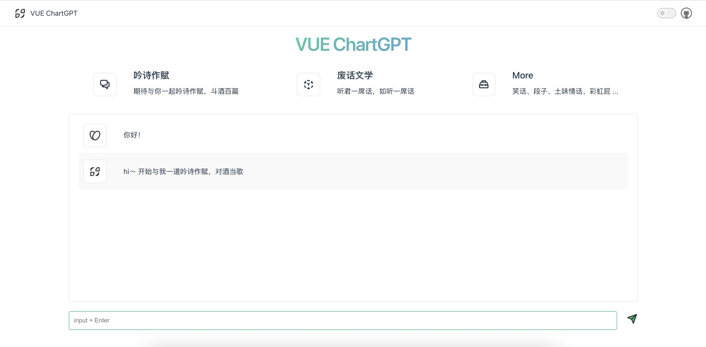

预览地址：https://xuyangzhou.github.io/vue-chartgpt/#/

**##技术栈**

vue3 + vite + typescript + pinia

**## 目录**

```
├── assets  // 静态资源
│   ├── base.css
│   └── main.css
├── components  // 公共组件
│   ├── icons   // svg icon
│   ├── ChartView.vue
│   ├── AskContent.vue
│   ├── ReplyContent.vue
│   ├── SwitchTheme.vue
│   └── HeaderBar.vue
├── router  // 路由配置
│   └── index.ts
├── stores  // pinia状态管理
│   └── counter.ts
├── types  // ts类型声明
│   └── index.ts
├── utils  // 工具类
│   └── request.ts // axios 封装
├── view  // 页面
│   ├── HomeView.vue
│   └── AboutView.view
├── tsconfig.json
└── vite.config.ts
```


**## vue chartgpt**

「🐶保命」之所以叫做vue chartGPT 完全是标题党，确切说应该是vue chartLTM（Listen to me），引用吕子乔的话来说就是不是看你要问什么，得看我回复什么！主要用来学习体验vue3全家桶


**## 成为Contributor**

如果感兴趣可以与我一起来完善该项目，体验vue3的开发体验，或者有好的想法通过issue来告知我，逐步完善，共同进步


**## 截图**





**## Recommended IDE Setup**


[VSCode](https://code.visualstudio.com/) + [Volar](https://marketplace.visualstudio.com/items?itemName=Vue.volar) (and disable Vetur) + [TypeScript Vue Plugin (Volar)](https://marketplace.visualstudio.com/items?itemName=Vue.vscode-typescript-vue-plugin).


**## Type Support for** **`.vue`** **Imports in TS**


TypeScript cannot handle type information for `.vue` imports by default, so we replace the `tsc` CLI with `vue-tsc` for type checking. In editors, we need [TypeScript Vue Plugin (Volar)](https://marketplace.visualstudio.com/items?itemName=Vue.vscode-typescript-vue-plugin) to make the TypeScript language service aware of `.vue` types.


If the standalone TypeScript plugin doesn't feel fast enough to you, Volar has also implemented a [Take Over Mode](https://github.com/johnsoncodehk/volar/discussions/471#discussioncomment-1361669) that is more performant. You can enable it by the following steps:


\1. Disable the built-in TypeScript Extension

​    \1) Run `Extensions: Show Built-in Extensions` from VSCode's command palette

​    \2) Find `TypeScript and JavaScript Language Features`, right click and select `Disable (Workspace)`

\2. Reload the VSCode window by running `Developer: Reload Window` from the command palette.


**## Customize configuration**


See [Vite Configuration Reference](https://vitejs.dev/config/).


**## Project Setup**


\```sh

npm install

\```


**### Compile and Hot-Reload for Development**


\```sh

npm run dev

\```


**### Type-Check, Compile and Minify for Production**


\```sh

npm run build

\```


**### Run Unit Tests with [****Vitest****](**https://vitest.dev/**)**


\```sh

npm run test:unit

\```


**### Lint with [****ESLint****](**https://eslint.org/**)**


\```sh

npm run lint

\```